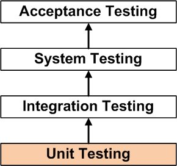

## Unit testing

##### What is a unit test?
Unit testing is a software development process in which the smallest testable parts of an application, called units, are individually and independently scrutinized for proper operation.

##### What is a unit?
  * A unit may be an individual program, function, procedure, etc.
  * A unit usually has one or a few inputs and usually a single output.

##### What's the relation between unit testing and TDD?
Test-driven development requires that developers first write failing unit tests. Then they write code and refactor the application until the test passes.
Unit testing involves only those characteristics that are vital to the performance of the unit under test.

##### When is it performed?
Unit Testing is the first level of testing and is performed prior to Integration Testing.

##### Benefits of unit testing
  * The earlier a problem is identified, the fewer compound errors occur.
  * A compound error is one that doesn't seem to break anything at first, but eventually conflicts with something down the line and results in a problem.

## Integration testing

##### What is an integration test?
It's a software development process which program units are combined and tested as groups in multiple ways.

##### How is integration done?
  * The output of the unit tests are called   modules.
  * We group them together.
  * apply tests as defined in test plan.

##### What are integration techniques?
1. Big-bang:

 Big Bang integration testing all components or modules are integrated simultaneously, after which everything is tested as a whole. So all modules are integrated simultaneously then the testing is carried out.

2. Top-down:

 Testing takes place from top to bottom, following the control flow or architectural structure (e.g. starting from the GUI or main menu). Components or systems are substituted by stubs.

3. Bottom-up:

 All the bottom or low-level modules, procedures or functions are integrated and then tested. After the integration testing of lower level integrated modules, the next level of modules will be formed and can be used for integration testing.

4. Sandwich (mixed):

  Sandwich testing combines the features of both Top down and bottom up approach.
  Integration starts from the middle layer and moves simultaneously towards up and down. In case of our figure, our testing will start from B1 and B2, where one arm will test the upper module A and another arm will test the lower modules B1C1, B1C2 & B2C1, B2C2 .

  ##### When is it performed?
  Integration Testing is the second level of testing and is performed after to Unit Testing.

##### Tips
* Ensure that you have a proper Detail Design document where interactions between each unit are clearly defined. In fact, you will not be able to perform Integration Testing without this information.
* Ensure that you have a robust Software Configuration Management system in place. Or else, you will have a tough time tracking the right version of each unit, especially if the number of units to be integrated is huge.
* Make sure that each unit is first unit tested before you start Integration Testing.
* As far as possible, automate your tests, especially when you use the Top Down or Bottom Up approach, since regression testing is important each time you integrate a unit, and manual regression testing can be inefficient.  
